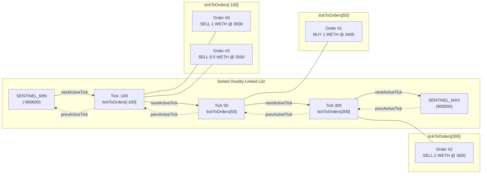
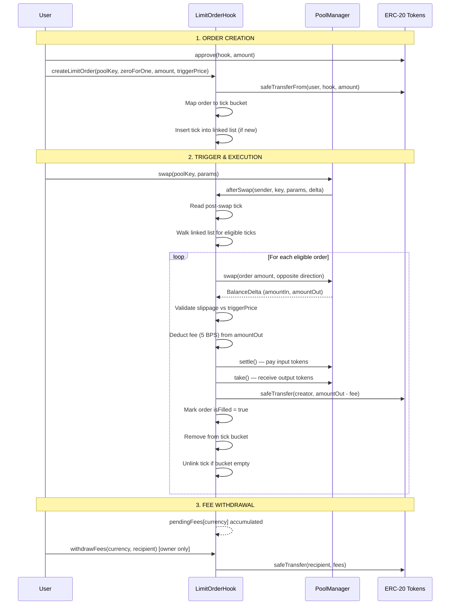

# LimitOrderHook — On-Chain Limit Orders for Uniswap V4

[](https://github.com/impetus82/limit-order-hook-v4/actions)
[](LICENSE)
[](https://docs.soliditylang.org/)
[](https://docs.uniswap.org/contracts/v4/overview)

Fully on-chain limit orders for Uniswap V4 — no off-chain relayers, no keepers, no trust assumptions beyond the Uniswap V4 PoolManager itself.

Orders execute automatically inside `afterSwap` when pool price crosses the trigger price.

🔗 **[Launch DApp](https://limit-order-hook-v4.vercel.app)**

---

## Deployments

| Network | Contract | Address | Explorer |
|---------|----------|---------|----------|
| **Base** (8453) | LimitOrderHook v2 | `0x45d971BdE51dd5E109036aB70a4E0b0eD2Dc4040` | [BaseScan](https://basescan.org/address/0x45d971BdE51dd5E109036aB70a4E0b0eD2Dc4040) |
| **Base** | PoolManager | `0x498581fF718922c3f8e6A244956aF099B2652b2b` | [BaseScan](https://basescan.org/address/0x498581fF718922c3f8e6A244956aF099B2652b2b) |
| **Base** | Gnosis Safe (2-of-3) | `0xDA0E8087E5c28F7616695F3aa19677C339CBE64e` | [BaseScan](https://basescan.org/address/0xDA0E8087E5c28F7616695F3aa19677C339CBE64e) |
| **Unichain** (130) | LimitOrderHook | `0x9138F699F5F5AB19ed8271c3B143B229781A8040` | [Uniscan](https://uniscan.xyz/address/0x9138F699F5F5AB19ed8271c3B143B229781A8040) |
| **Unichain** | PoolManager | `0x1F98400000000000000000000000000000000004` | [Uniscan](https://uniscan.xyz/address/0x1F98400000000000000000000000000000000004) |
| **Unichain** | Gnosis Safe (2-of-3) | `0x91C6e38f8EdC53F774359845817FACF4eF0a339B` | [Uniscan](https://uniscan.xyz/address/0x91C6e38f8EdC53F774359845817FACF4eF0a339B) |

Both deployments are source-verified. Ownership is held by 2-of-3 Gnosis Safe multisigs.

---

## Key Features

### O(1) Tick Buckets via Sorted Doubly-Linked List

Instead of scanning consecutive ticks (wasting gas on empty space), the hook maintains a sorted doubly-linked list of only those ticks that hold active orders. Insertion and removal are O(1); scanning during `afterSwap` touches only populated ticks.

### Anti-DoS Graceful Execution

`_executeOrder` returns a boolean instead of reverting. A single malformed or unfillable order cannot block swaps for the entire pool. Failed orders emit `OrderExecutionFailed` and stay in the bucket for retry on the next swap.

### Gas-Metered Batch Execution

A `gasleft()` check (150k threshold) stops execution gracefully before running out of gas. Remaining orders persist and execute on subsequent swaps.

### 5 BPS Execution Fee

A configurable fee (default 0.05%, max 0.50%) is deducted from `amountOut` on each successful fill. Fees accumulate per-currency and are withdrawable by the owner via `withdrawFees()`.

---

## Architecture

### Data Structure: Tick Buckets & Linked List



Each tick bucket maps to an array of order IDs. When a bucket empties (all orders filled or cancelled), the tick is unlinked from the list in O(1).

### Execution Flow: Order Lifecycle



---

## Project Structure

```
├── src/
│   └── LimitOrderHook.sol          # Core hook contract (~960 LOC)
├── test/
│   ├── LimitOrderHook.t.sol        # Unit tests (5 tests)
│   └── LimitOrderHookIntegration.t.sol  # Integration tests (33 tests)
├── script/
│   ├── DeployMainnet.s.sol          # Multi-chain deploy (Base & Unichain)
│   ├── AddLiquidityBase.s.sol       # Liquidity provisioning (Base)
│   ├── TriggerSwapBase.s.sol        # E2E trigger swap (Base)
│   ├── AddLiquidityUnichain.s.sol   # Liquidity provisioning (Unichain)
│   └── TriggerSwapUnichain.s.sol    # E2E trigger swap (Unichain)
├── frontend/                        # Next.js DApp (Wagmi v2 + RainbowKit)
│   └── src/
│       ├── app/page.tsx             # Main page
│       ├── components/              # UI components
│       └── config/contracts.ts      # Multi-chain contract addresses
├── DESIGN.md                        # Original design document
└── AUDIT_SCOPE.md                   # Audit scope & known issues
```

---

## Getting Started

### Prerequisites

- [Foundry](https://book.getfoundry.sh/getting-started/installation) (forge, cast, anvil)
- Node.js 18+ (for frontend)

### Build & Test

```bash
# Clone
git clone https://github.com/impetus82/limit-order-hook-v4.git
cd limit-order-hook-v4

# Install dependencies
forge install

# Build
forge build

# Run all tests (38 tests)
forge test -vv
```

### Frontend

```bash
cd frontend
npm install
npm run dev
# Open http://localhost:3000
```

### Deploy

```bash
# Copy env template and fill in your keys
cp .env.example .env

# Deploy to Base
forge script script/DeployMainnet.s.sol:DeployMainnet \
  --rpc-url $BASE_RPC_URL --broadcast --verify \
  --etherscan-api-key $BASESCAN_API_KEY \
  --slow --with-gas-price 100000000 -vvvv
```

---

## Security

- **Ownership:** Gnosis Safe 2-of-3 multisig on both chains
- **Reentrancy:** OpenZeppelin ReentrancyGuard on `createLimitOrder` and `cancelOrder`
- **Overflow:** OpenZeppelin SafeCast on all unsafe truncation paths
- **Slippage:** `amountOut` validated against `triggerPrice` with 0.5% tolerance
- **DoS:** Graceful non-reverting execution; gas metering at 150k threshold
- **Admin:** `forceCancelOrder` for stuck/orphaned order cleanup; `setFeeBps` capped at 50 BPS

> ⚠️ **This contract has not been formally audited.** Use at your own risk. See [AUDIT_SCOPE.md](AUDIT_SCOPE.md) for details.

---

## Token Sort Order

Uniswap V4 sorts tokens by address. The sort order differs between chains:

| Chain | currency0 | currency1 |
|-------|-----------|-----------|
| Base | WETH (`0x4200...0006`) | USDC (`0x8335...2913`) |
| Unichain | USDC (`0x078d...57ad6`) | WETH (`0x4200...0006`) |

All swap directions, `sqrtPriceLimitX96`, and price math are inverted accordingly. The frontend handles this via the `wethIsCurrency0` flag in `contracts.ts`.

---

## License

MIT